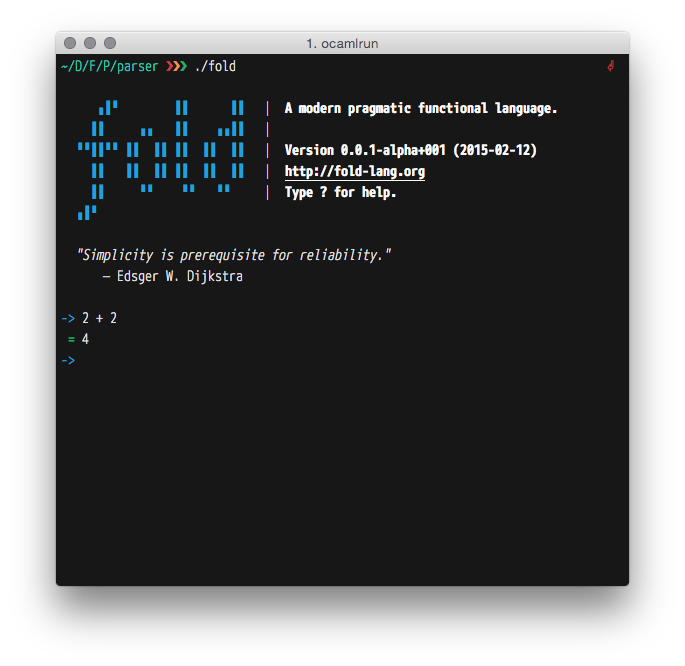

pratt-parser
============
Top down operator precedence parser (also known as Pratt parser) implementation for OCaml.

This project is part of Fold Programming Language. For more information visit:

- <http://github.com/fold-lang/fold>

